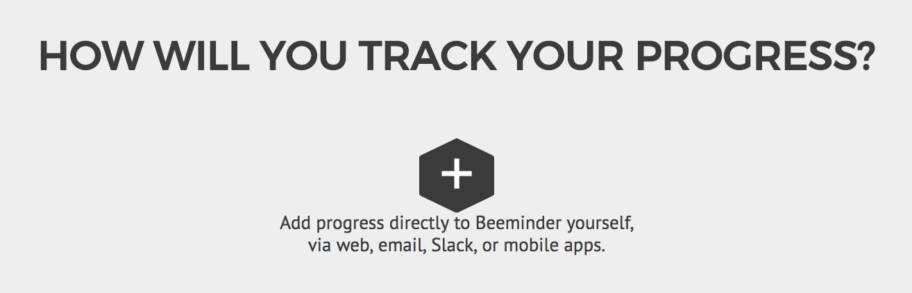
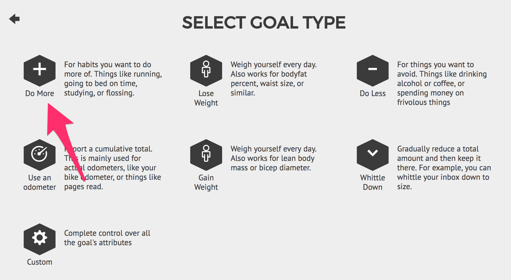
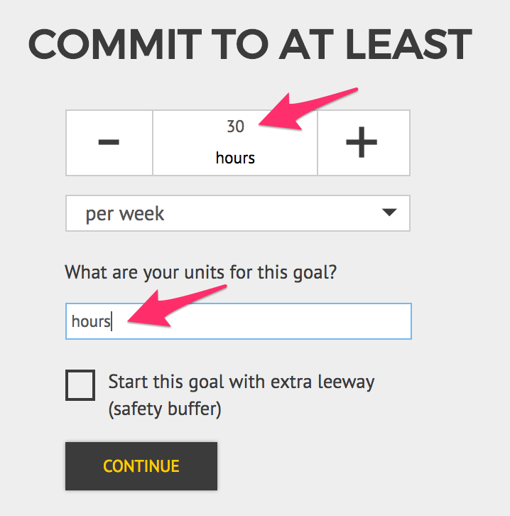
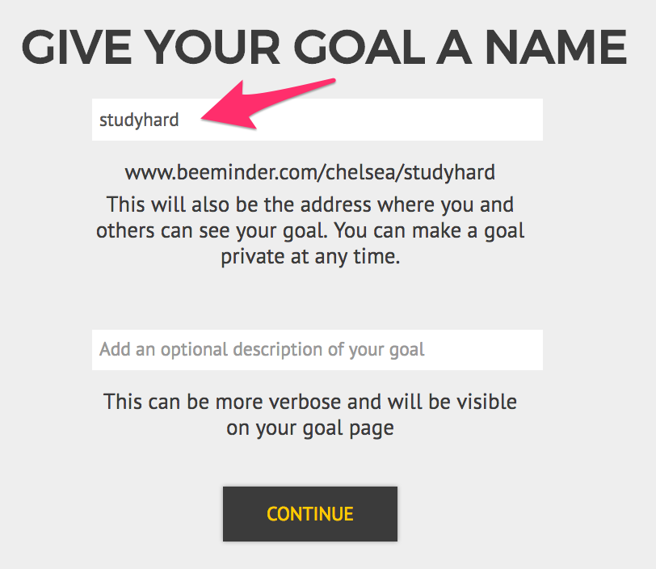
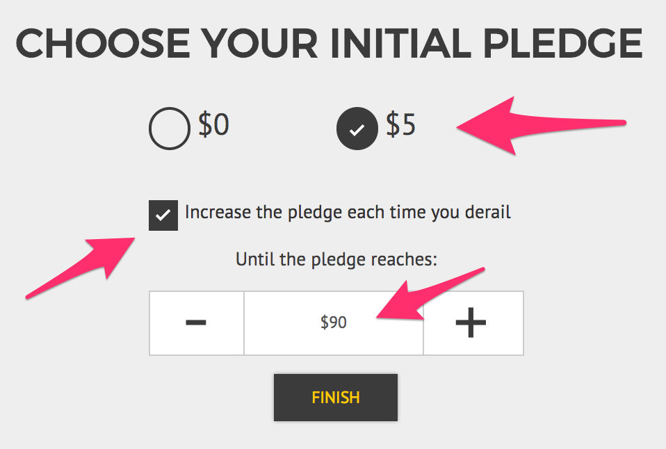
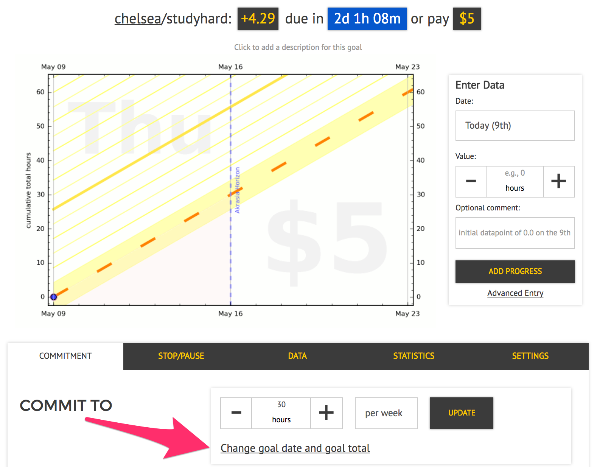
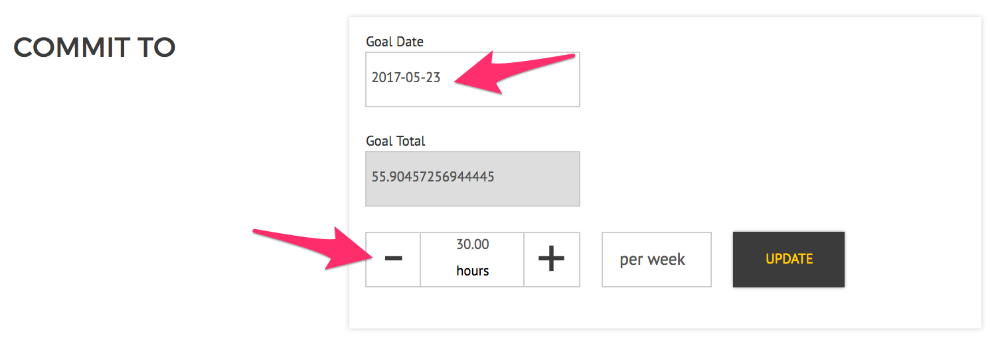
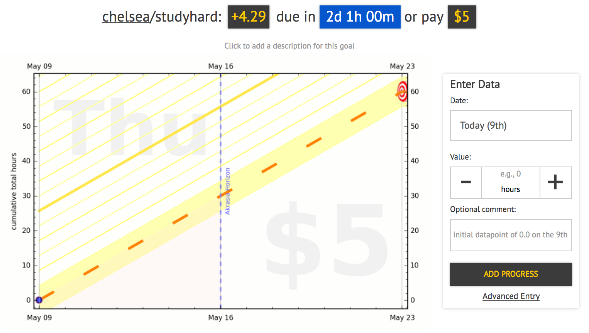

Goal: to study for at least 30 hours a week for the two weeks leading up to my final exams!  I'll be entering my data manually, not using any autodata or self-coded integration.

1) On the [goal creation page](https://www.beeminder.com/new), click the + icon to create a new manual-data goal.

2) Click the + icon again to select the Do-More goal type.

3) Fill in the quantity and the units that you want to commit to for this goal.  I'm using the weekly option, so I don't need to change that field.  I also want to start my goal immediately, so I'm choosing not to tick the safety buffer box.

4) Name your goal in the top textbox.  If you want, you can include more information, or maybe an inspirational message to yourself, in the second box.

5) Now, the most important part -- the pledge settings!!  For this goal, I want to start my pledge at $5, so I've got pressure to start studying immediately.  I want the pledge to keep going up if I derail on the goal, so I leave that box checked.  And I'm willing to let the pledge rise to $90 if I derail often enough, but not any higher than that, so I use the + icon to step up that value.  Once everything looks good, click 'Finish' to create the goal!

6) Now I have a Beeminder goal!  I need to study at least 4.29 hours over the next 2 days, or else I'll derail and have to pay my $5 pledge.  Just one more thing to configure -- the end date.  In the 'Commit To' section of the 'Commitment' tab below the graph, I'll click the link shown to expand the goal configuration.

7) I set the end date to May 23, two weeks from now.  The gray box in the middle is Beeminder calculating about how many hours I'll have studied by then.  (TODO: this looks so dumb when 2 wks * 30 hrs = 60 even though i know what's going on!! ahh!!)  Notice how the other two boxes have a white background?  Double-check that the right boxes are white and that the value inside them are what you want, then click 'Update' to make the change.

8) And voila!  The end is now in sight on my goal, and I'm ready to start studying and adding data.  

