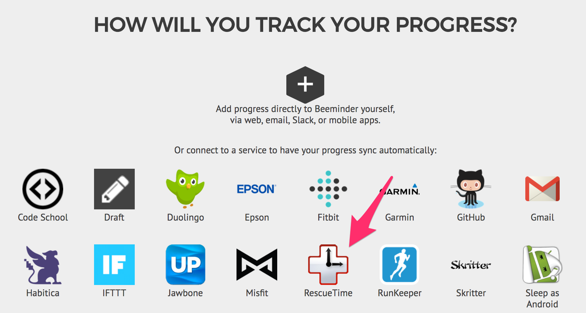
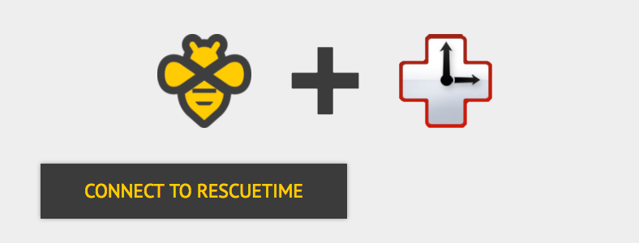
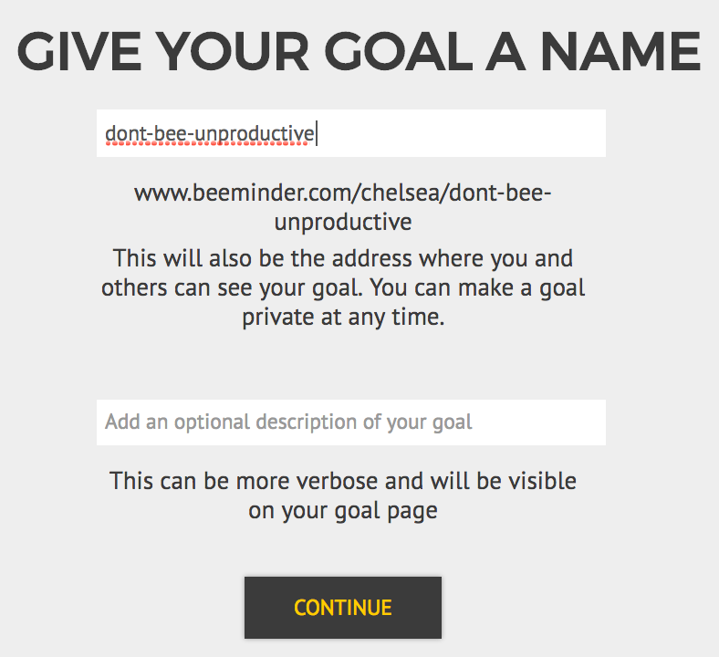
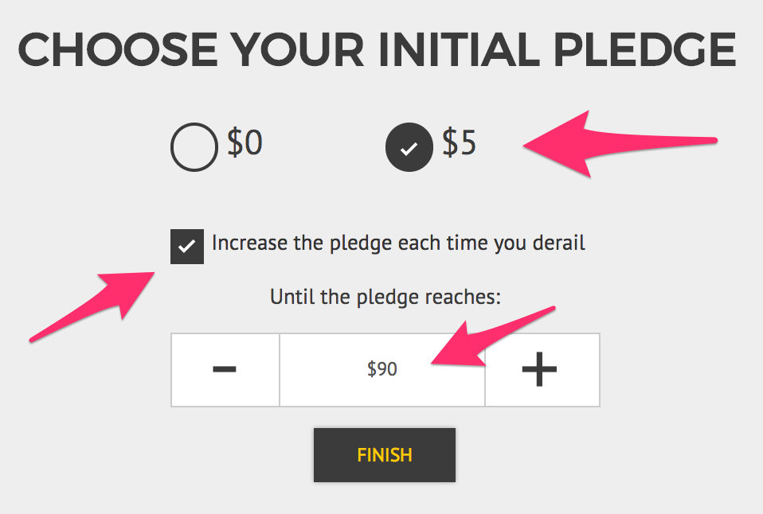
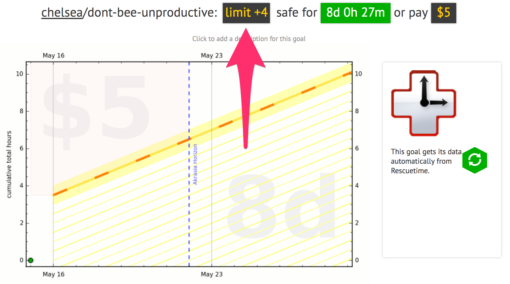
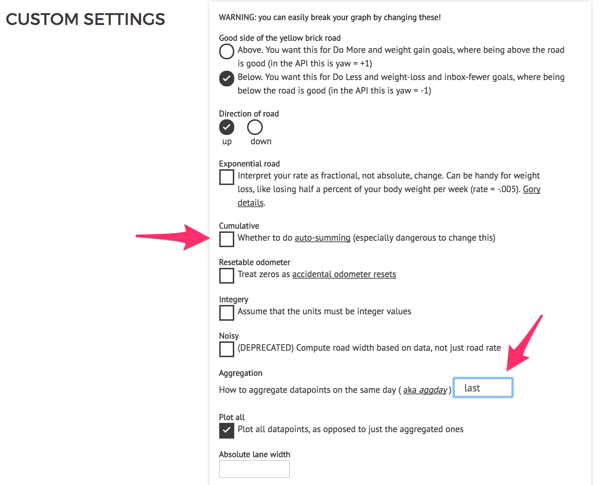
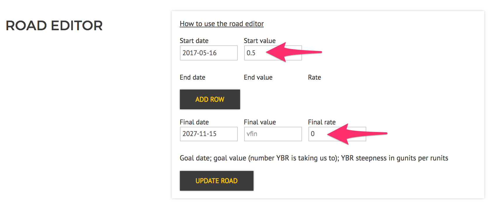
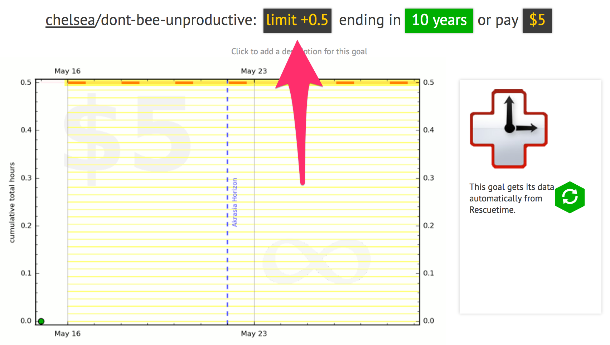

(copied from other example todos: replace final image w/ arrowed version, more exposition, more bullety instructions vs. paras, final para on other settings you may want to change & links to pages (e.g. nomercy, reminders, ???))

In this example, we'll use the RescueTime autodata integration as our data source, but switch up the goal type using Beeminder custom (todo link) goal features to make it work a little differently than standard RescueTime goals do!

1) On the [goal creation page](https://www.beeminder.com/new), click the RescueTime icon to create a new RescueTime goal.

2) If you haven't yet paired your RescueTime and Beeminder accounts, you'll see this button popup first.  Enter your RescueTime login on the page that will pop up afterward.  This should redirect you back to Beeminder -- click the RT icon shown in step 1 to continue the goal creation process!

3) Choose the goal parameters.  For this goal, I want to limit my time to 30 unproductive minutes per day, so I choose to do at most 3.5 hours per week of Unproductive Time.  (todo: where is the category list?)

4) Name your goal in the top textbox.  If you want, you can include more information, or maybe an inspirational message to yourself, in the second box.

5) Now, the most important part -- the pledge settings!!  For this goal, I want to start my pledge at $5, so I've got pressure to limit my time immediately.  I want the pledge to keep going up if I derail on the goal, so I leave that box checked.  And I'm willing to let the pledge rise to $90 if I derail often enough, but not any higher than that, so I use the + icon to step up that value.  Once everything looks good, click 'Finish' to create the goal!

6) Now I have a Beeminder goal!  The most important thing I need to pay attention to on this goal is my allowed time today.  The limit is 4 hours - if I have more than 4 hours of unproductive time today, I will derail on my goal!  Next, I'll make the custom changes to switch from a cumulative limit to a daily limit.

7) At the bottom of the 'Settings' tab, if you are a Bee Plus or Beemium subscriber, you'll see this section that lets you enable custom goal settings.  Push the button!  

8) Nothing has changed about the goal yet, but now there's a whole menu of new options in the 'Custom Settings' section.  I **unchecked** the cumulative setting and changed the daily aggregation method to **last**.  (See more info about those settings here! (todo link custom))  Press 'Save Settings' to make the changes take effect.

9) And now the last step - road modifications!  Now that this goal will "reset" daily, rather than summing up my hours over time, I need to flatline the yellow brick road to enforce my 30min/day limit.  To do that, I'll use the road matrix (todo: create road matrix FAQ instro page & link), changing the values in the fields indicated below.  0.5 hours (30 min) is my max value, and I want the rate to bee 0.  Click the 'Update Road' button to dial in the changes - since I've technically made the goal harder now, they'll bee applied immediately!

10) Now my goal looks like how I wanted it to!  My limit has dropped to 0.5 unproductive hours allowed for today, and it'll be that way every day... for the next 10 years :scream:  

(todo: maybe show how it looks in 1/2/4 weeks or something too??  also to double-check that this all works how i expect it to.)

(After reading this walkthrough, you may bee wondering "why don't you just use the regular do-less and (maybee automatically) remove safety buffer?"  The answer is... You could absolutely do that too!  I just kind of prefer the way this graph image ends up looking, so I wrote a guide to show it off!)
